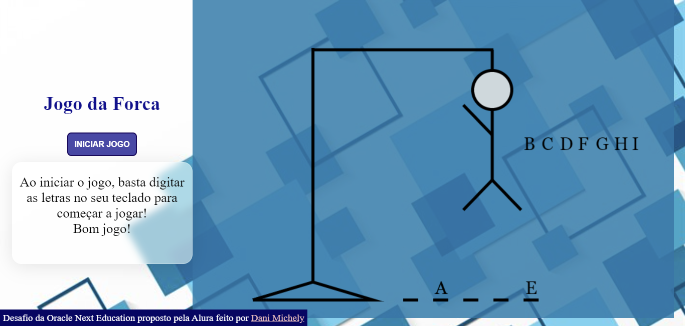
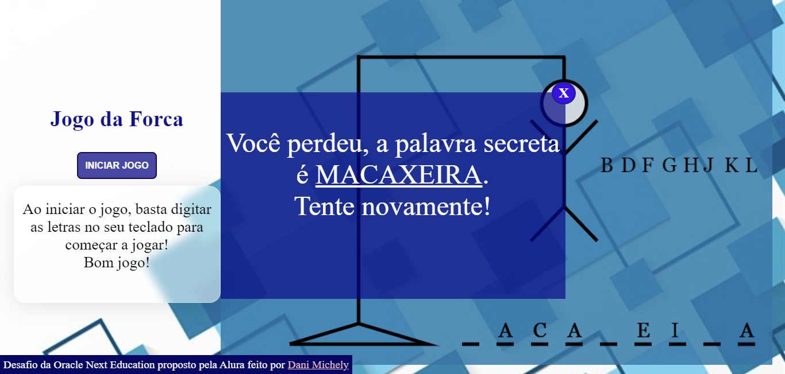
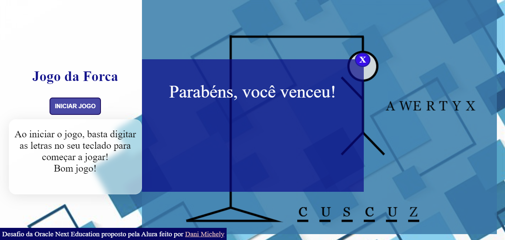

# Jogo da Forca - Challenge One - Oracle Next Education

O jogo da forca é um desafio de código do programa da Oracle proposto pela Alura

### Screenshot

### Links

- Solução URL: https://jogo-da-forca-dani-michely.netlify.app/

### Construído com

- HTML5

- CSS3

- JavaScript

  

### Autora

- Linkedin: https://www.linkedin.com/in/dani-michely/

